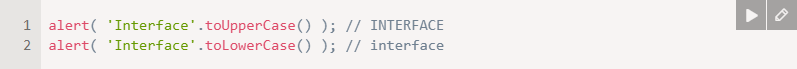
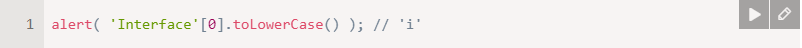
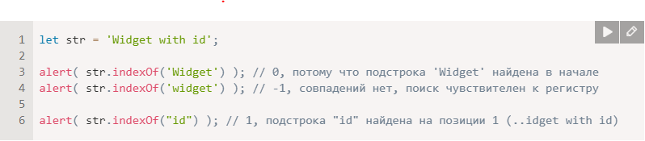
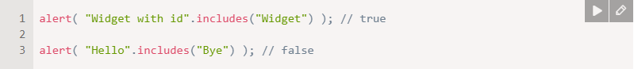
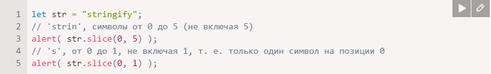
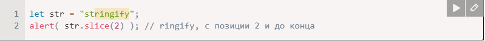
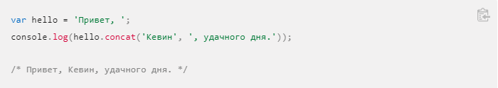
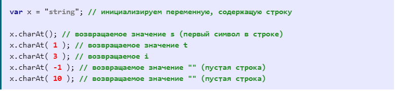

# day1Lacture3

# Что такое методы в Javascript
Методы JavaScript это действия, которые можно выполнить с объектами. Метод JavaScript это свойство, содержащее определение функции. Методы это функции, хранящиеся как свойства объекта.

# Кавычки
В JavaScript есть разные типы кавычек.
Строку можно создать с помощью одинарных, двойных либо обратных кавычек:

# Изменение регистра
Методы toLowerCase() и toUpperCase() меняют регистр символов:

Если мы захотим перевести в нижний регистр какой-то конкретный символ:

# str.indexOf
Первый метод — str.indexOf(substr, pos).
Он ищет подстроку substr в строке str, начиная с позиции pos, и возвращает позицию, на которой располагается совпадение, либо -1 при отсутствии совпадений.

# includes
Более современный метод str.includes(substr, pos) возвращает true, если в строке str есть подстрока substr, либо false, если нет.

Это — правильный выбор, если нам необходимо проверить, есть ли совпадение, но позиция не нужна:

# Получение подстроки
В JavaScript есть 3 метода для получения подстроки: substring, substr и slice.

str.slice(start [, end])
Возвращает часть строки от start до (не включая) end.

Например:

Если аргумент end отсутствует, slice возвращает символы до конца строки:

# replace ()
Вы можете заменить одну подстроку внутри строки на другую подстроку, используя метод replace (). Этот метод работает очень просто на базовом уровне, но у него есть некоторые продвинутые свойства, но мы пока не будем вдаваться в детали.

# replaceall()
Метод replaceAll()возвращает новую строку, в которой все совпадения patternзаменены на replacement. Может patternбыть строкой или RegExp, а также replacementможет быть строкой или функцией, которая вызывается для каждого совпадения. Исходная строка остается неизменной.

Он принимает два параметра — строку, которую вы хотите заменить, и строку, которую вы хотите вставить вместо заменяемой. Попробуйте этот пример:

# browserType.replace('moz','van');

# concat()
Метод concat() объединяет текст из двух или более строк и возвращает новую строку.

# charAt()
JavaScript метод charAt() возвращает символ по заданному индексу внутри строки. Индекс первого символа равен нулю, а последнего рассчитывается как значение длины строки - 1 (length - 1).

Обращаю Ваше внимание, что если метод charAt() используется со значением index, который выходит за пределы допустимого диапазона, возвращается пустая строка. Отрицательные значения расцениваются как значения, которые выходят за пределы допустимого диапазона.

Если метод используется без указания индекса элемента (без параметра), то используется значение по умолчанию равное нулю (возвращает первый символ в строке).

# repeat()
Метод repeat() конструирует и возвращает новую строку, содержащую указанное количество соединённых вместе копий строки, на которой он был вызван.
# str.repeat(count)

# split()
Метод split() разбивает объект String на массив строк путём разделения строки указанной подстрокой.

# var myString = 'Привет, мир. Как дела?';
# var splits = myString.split(' ');
# console.log(splits);

# trim()
Метод trim() удаляет пробельные символы с начала и конца строки. Пробельными символами в этом контексте считаются все собственно пробельные символы (пробел, табуляция, неразрывный пробел и прочие) и все символы конца строки (LF, CR и прочие).

Синтаксис:
# str.trim()

# toString()
Метод toString() возвращает строку, представляющую указанный объект.
Синтаксис:
# str.toString(

# search()
Метод search() ищет строку для указанного значения и возвращает позицию совпадения.
Значение поиска может быть строкой или регулярным выражением.
Этот метод возвращает -1, если совпадение не найдено.

# var string = "S Kingdoms";
# var result = string.search("Kingdoms"); // 4
